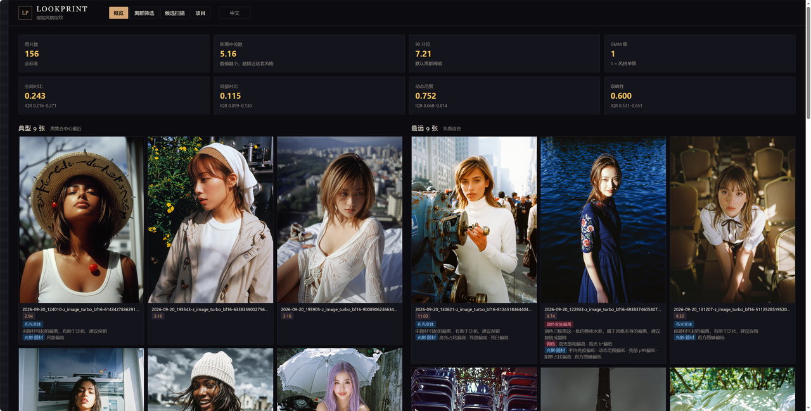
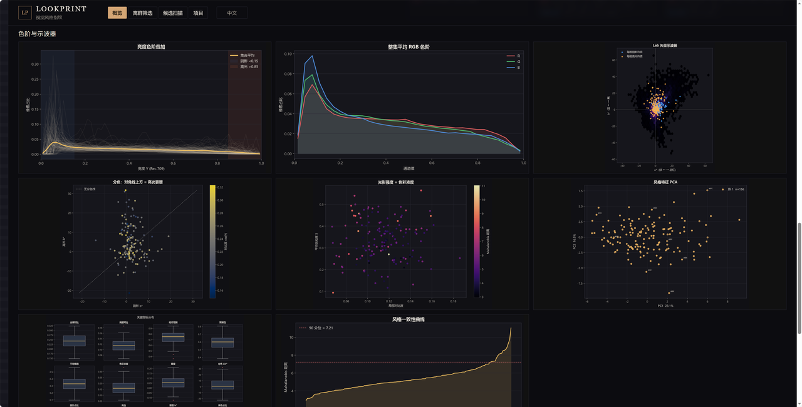
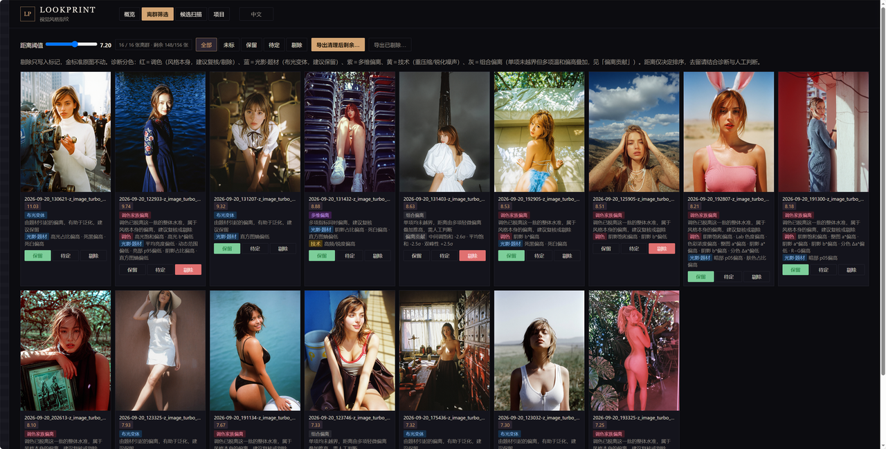
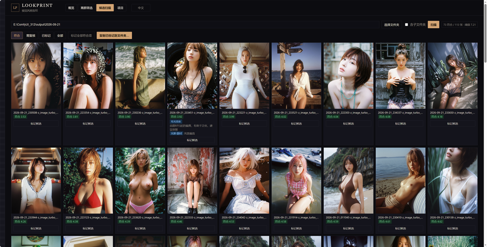

# Lookprint

[](LICENSE)
[](requirements.txt)
[]()

**LoRA 训练集的风格指纹工具。**

选一批已经用肉眼筛稳、风格统一的图作为金标准，Lookprint 将其提炼为一组可解释的摄影指标，并以此为准绳衡量其他图片的风格偏离程度。它主要做两件事：

**一、精炼训练集。** 对金标准数据集逐张分析，找出明显偏离整体风格的图片。训练风格 LoRA 之前用它清洗数据：少数离群图会稀释风格特征，剔除之后指纹更聚焦。剔除只写标记，原图不动。

**二、检验生成效果。** 以金标准数据集为基准，对指定目录的图片逐张评分——例如 LoRA 的出图结果——衡量生成结果是否贴合训练数据集的风格，为「这版 LoRA 能不能用、要不要再训」提供可比较的依据。

风格以金标准为准绳：它是什么风格，就测什么风格——胶片模拟、电影级调色、干净数码、插画渲染，皆可。

纯本地运行的 Web 小工具（FastAPI，端口 8788）：色阶与示波器、离群筛选、候选扫描都在浏览器中完成，无需联网。

English | [简体中文](README.zh-CN.md) | [设计说明](notes/DESIGN.md)

<p align="center">
  
  
  
  
</p>

## 为什么需要它

给数据集打分的工具大多是黑盒：CLIP/DINO 相似度，或单一美学评分。它们回答的是「这是不是张好照片」，而训练风格 LoRA 的人真正想问的是：

> **这张图与已筛选的集合是否属于同一风格家族——调色是否一致，光照是否一致？**

Lookprint 用摄影语言回答这个问题：分色调、明暗分离、高光滚降、颗粒、光的方向，每个指标都有明确的摄影含义。风格以金标准为准，工具负责测量。

还有一条贯穿始终的设计立场：**分数高不等于该删**。一张图离群，很可能只是因为它有大面积蓝天、雪地——这类「题材造成的偏离」对 LoRA 泛化反而有用。真正值得警惕的，是调色已经脱离这批图整体水准的那几张。

## 功能一览

- **数据集精炼（离群筛选）** — 按马氏距离从大到小排序，每张图下方标注诊断：哪些指标越界、属于哪个家族、建议如何处理；在灯箱中用快捷键 1/2/3 定去留，用于训练前的数据清洗
- **生成检验（候选扫描）** — 以金标准为基准，对任意文件夹逐张打分，达到阈值的标「符合」，其余标「需复核」；例如直接拿 LoRA 出图目录来检验贴合度
- **风格指纹** — 每张图提约 35 个指标，集合的均值/协方差就是指纹；内置 GMM 分簇（按 BIC 定簇数）和 PCA 投影
- **caption 同步导出** — 图片与同名 `.txt` caption 一并复制，重名改名时 caption 同步更名，导出目录可直接用于训练
- **纯本地** — 不联网、不上传；剔除只记在项目数据里，不碰原图，也不往数据集旁边写任何 sidecar 文件

## 快速开始

```powershell
# Windows
py -3.12 -m venv .venv
.\.venv\Scripts\python.exe -m pip install -r requirements.txt
.\run.ps1            # 或 run.bat
```

```bash
# macOS / Linux
python3 -m venv .venv
./.venv/bin/python -m pip install -r requirements.txt
./run.sh
```

浏览器打开 http://127.0.0.1:8788 。首次使用：进入**项目**页选定金标准文件夹，点击**重新分析金标准**。界面右上角可切换中文/EN。

需要 Python 3.12+。数据集建议用「图片 + 同名 `.txt` caption」的形式，caption 不是必需。

## 四个页面

- **概览** — 指纹数字、离风格中心最近和最远的各 9 张、色阶、矢量示波器、光影×饱和散点
- **离群筛选** — 拖动距离滑杆圈出偏离图，逐张看诊断再定去留（灯箱快捷键 1/2/3）；导出剩余或导出已剔除
- **候选扫描** — 给候选文件夹逐张打分并分类；标记过的可以一键复制到新目录
- **项目** — 项目名、金标准路径、离群分位（默认 90）

## 命令行

```bash
python -m lookprint analyze                      # 从金标准建指纹
python -m lookprint scan "D:/new_picks"          # 给一个文件夹打分
python -m lookprint scan "D:/new_picks" --recursive
```

`--project` 可指定项目 id，不写就取第一个已有项目。

## 原理

每张图长边缩到 640，提约 35 个指标：亮度分位数、直方图熵、双峰性，阴影和高光各自的 a*/b* 分色，Hasler 色彩浓度，结构张量各向异性，双边滤波后的颗粒残差，等等。集合在这些指标上的均值/协方差就是指纹；新图算马氏距离即得分。

**离群诊断**会逐个指标过一遍 Tukey 栅栏（q ± 1.5·IQR），再把越界的按家族归类——同样是「越界」，含义天差地别：

| 家族 | 含义 | 建议 |
|---|---|---|
| 调色 | 调色已经不属于这一批，风格本身变了 | 复核或剔除 |
| 光影·题材 | 大面积天空、雪地、夜景造成的偏离 | 保留，利于泛化 |
| 技术 | 颗粒、锐度异常，多半是重压缩或过度锐化 | 复核 |
| 组合 | 没有单项越界，但多项轻微偏高叠加推高了距离 | 人工判断 |

整体距离还在阈值以内的，一律标注「轻微偏离」，建议先保留。

## 项目数据

运行时数据都在 `data/`（已被 git 忽略）：

```
data/projects/<id>/
  project.json              金标准路径与分位
  fingerprint.json          可读的指纹摘要
  fingerprint.pkl           scaler / 协方差 / GMM / PCA
  metrics.csv               每张图的指标与距离
  plots/                    分析图表（中文标签；英文标签存于 plots_en/）
  decisions.json            离群筛选：keep / maybe / drop
  marked_candidates.json    扫描标记
  scans/ + last_scan.json   扫描历史
```

把金标准换成另一个风格的数据集再重新分析，指纹、距离、阈值、诊断栅栏、图表全部按新图集重算，没有任何写死的数值。旧的剔除标记属于上一个数据集，分析成功后自动清空；扫描历史会保留，但里面的分数是按旧指纹算的，仅供参考。

## 开发

```bash
python -m pip install -r requirements-dev.txt
python -m pytest tests -q
```

## 参与贡献

欢迎提 Issue 和 PR。几个值得探索的方向：按文件格式（PNG/JPEG）分组统计、在摄影指标之外加一层语义指标（CLIP/DINOv2）、多项目管理界面。

## 许可

[MIT](LICENSE)
